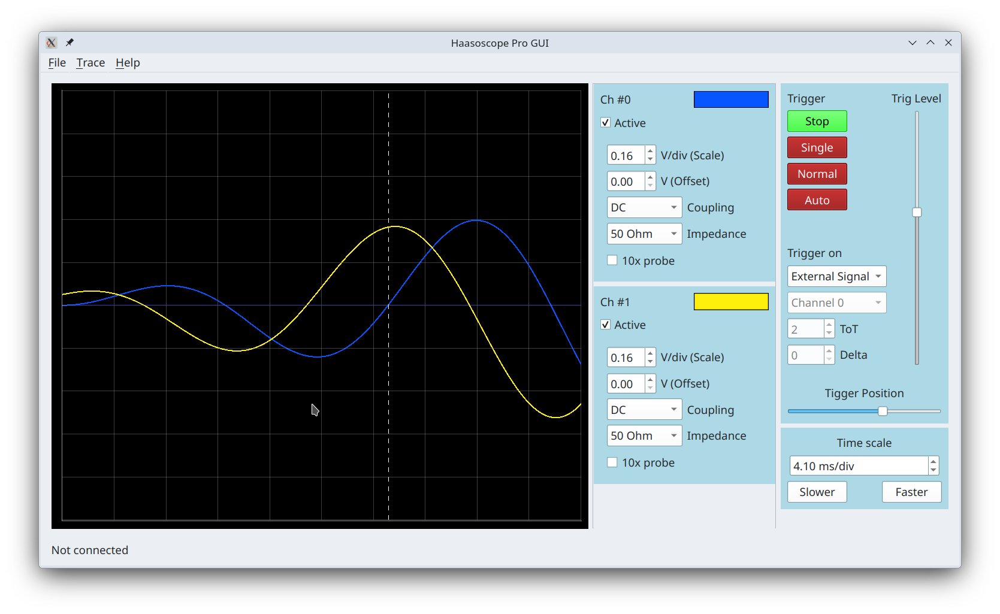

# HaasoscopeProGUI

## How to run this GUI from source code.

First make sure that `uv` is installed. Then, in the terminal (or Powershell) window navigate to a directory where you 
want to place source code for this application and run following:

```shell
git clone https://github.com/priimak/HaasoscopeProGUI.git
cd HaasoscopeProGUI/
uv venv -p 3.13
source .venv/bin/activate
uv pip install --exact -r pyproject.toml
uv run --directory src -m hspro.gui.main
```

After the last line you should see following window

